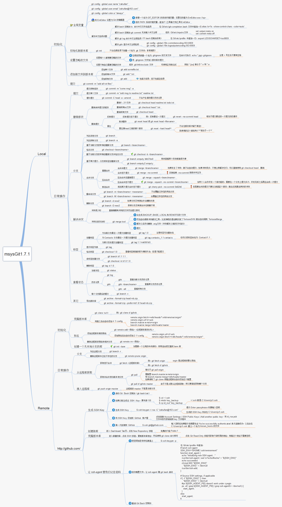

# Git的奇技淫巧:see_no_evil:
> Git常用命令集合，Fork於[tips](https://github.com/git-tips/tips)項目

Git是一個 「分佈式版本管理工具」，簡單的理解版本管理工具：大家在寫東西的時候都用過 「回撤」 這個功能，但是回撤只能回撤幾步，假如想要找回我三天之前的修改，光用 「回撤」 是找不回來的。而 「版本管理工具」 能記錄每次的修改，只要提交到版本倉庫，你就可以找到之前任何時刻的狀態（文本狀態）。

下面的內容就是列舉了常用的 Git 命令和一些小技巧，可以通過 "頁面內查找" 的方式進行快速查詢：`Ctrl/Command+f`。

## 開卷必讀
*如果之前未使用過 Git，可以學習 [Git 小白教程](http://rogerdudler.github.io/git-guide/index.zh.html)入門*

1. **一定要先測試命令的效果後**，再用於工作環境中，以防造成不能彌補的後果！**到時候別拿著砍刀來找我**
2. 所有的命令都在`git version 2.7.4 (Apple Git-66)`下測試通過
3. 統一概念：
	- 工作區：改動（增刪文件和內容）
	- 暫存區：輸入命令：`git add 改動的文件名`，此次改動就放到了 『暫存區』
	- 本地倉庫(簡稱：本地)：輸入命令：`git commit 此次修改的描述`，此次改動就放到了 』本地倉庫』，每個 commit，我叫它為一個 『版本』。
	- 遠程倉庫(簡稱：遠程)：輸入命令：`git push 遠程倉庫`，此次改動就放到了 『遠程倉庫』（GitHub 等)
	- commit-id：輸出命令：`git log`，最上面那行 `commit xxxxxx`，後面的字符串就是 commit-id
4. 如果喜歡這個項目，歡迎 Star、提交 Pr、[反饋問題](https://github.com/521xueweihan/git-tips/issues)😊

## 目錄
* [展示幫助信息](#展示幫助信息)
* [回到遠程倉庫的狀態](#回到遠程倉庫的狀態)
* [重設第一個commit](#重設第一個-commit)
* [展示工作區和暫存區的不同](#展示工作區和暫存區的不同)
* [展示暫存區和最近版本的不同](#展示暫存區和最近版本的不同)
* [展示暫存區、工作區和最近版本的不同](#展示暫存區工作區和最近版本的不同)
* [快速切換分支上一個分支](#快速切換分支上一個分支)
* [刪除已經合併到 master 的分支](#刪除已經合併到-master-的分支)
* [展示本地分支關聯遠程倉庫的情況](#展示本地分支關聯遠程倉庫的情況)
* [關聯遠程分支](#關聯遠程分支)
* [列出所有遠程分支](#列出所有遠程分支)
* [列出本地和遠程分支](#列出本地和遠程分支)
* [創建並切換到本地分支](#創建並切換到本地分支)
* [從遠程分支中創建並切換到本地分支](#從遠程分支中創建並切換到本地分支)
* [刪除本地分支](#刪除本地分支)
* [刪除遠程分支](#刪除遠程分支)
* [重命名本地分支](#重命名本地分支)
* [查看標籤](#查看標籤)
* [查看標籤詳細信息](#查看標籤詳細信息)
* [本地創建標籤](#本地創建標籤)
* [推送標籤到遠程倉庫](#推送標籤到遠程倉庫)
* [刪除本地標籤](#刪除本地標籤)
* [刪除遠程標籤](#刪除遠程標籤)
* [切回到某個標籤](#切回到某個標籤)
* [放棄工作區的修改](#放棄工作區的修改)
* [恢復刪除的文件](#恢復刪除的文件)
* [以新增一個 commit 的方式還原某一個 commit 的修改](#以新增一個-commit-的方式還原某一個-commit-的修改)
* [回到某個 commit 的狀態，並刪除後面的 commit](#回到某個-commit-的狀態並刪除後面的-commit)
* [修改上一個 commit 的描述](#修改上一個-commit-的描述)
* [查看 commit 歷史](#查看-commit-歷史)
* [顯示本地更新過 HEAD 的 git 命令記錄](#顯示本地更新過-head-的-git-命令記錄)
* [修改作者名](#修改作者名)
* [修改遠程倉庫的 url](#修改遠程倉庫的-url)
* [增加遠程倉庫](#增加遠程倉庫)
* [列出所有遠程倉庫](#列出所有遠程倉庫)
* [查看兩個星期內的改動](#查看兩個星期內的改動)
* [把 A 分支的某一個 commit，放到 B 分支上](#把-A-分支的某一個-commit-放到-B-分支上)
* [給 git 命令起別名](#給-git-命令起別名)
* [存儲當前的修改，但不用提交 commit](#存儲當前的修改但不用提交-commit)
* [保存當前狀態，包括 untracked 的文件](#保存當前狀態包括-untracked-的文件)
* [展示所有 stashes](#展示所有-stashes)
* [回到某個 stash 的狀態](#回到某個-stash-的狀態)
* [回到最後一個 stash 的狀態，並刪除這個 stash](#回到最後一個-stash-的狀態並刪除這個-stash)
* [刪除所有的 stash](#刪除所有的-stash)
* [從 stash 中拿出某個文件的修改](#從-stash-中拿出某個文件的修改)
* [展示所有 tracked 的文件](#展示所有-tracked-的文件)
* [展示所有 untracked 的文件](#展示所有-untracked-的文件)
* [展示所有忽略的文件](#展示所有忽略的文件)
* [強制刪除 untracked 的文件](#強制刪除-untracked-的文件)
* [強制刪除 untracked 的目錄](#強制刪除-untracked-的目錄)
* [展示簡化的 commit 歷史](#展示簡化的-commit-歷史)
* [查看某段代碼是誰寫的](#查看某段代碼是誰寫的)
* [把某一個分支到導出成一個文件](#把某一個分支到導出成一個文件)
* [從包中導入分支](#從包中導入分支)
* [執行 rebase 之前自動 stash](#執行-rebase-之前自動-stash)
* [從遠程倉庫根據 ID，拉下某一狀態，到本地分支](#從遠程倉庫根據-ID-拉下某一狀態-到本地分支)
* [詳細展示一行中的修改](#詳細展示一行中的修改)
* [清除 `.gitignore` 文件中記錄的文件](#清除-gitignore-文件中記錄的文件)
* [展示所有 alias 和 configs](#展示所有-alias-和-configs)
* [展示忽略的文件](#展示忽略的文件)
* [commit 歷史中顯示 Branch1 有的，但是 Branch2 沒有 commit](#commit-歷史中顯示-Branch1-有的但是-Branch2-沒有-commit)
* [在 commit log 中顯示 GPG 簽名](#在-commit-log-中顯示-GPG-簽名)
* [刪除全局設置](#刪除全局設置)
* [新建並切換到新分支上，同時這個分支沒有任何 commit](#新建並切換到新分支上同時這個分支沒有任何-commit)
* [展示任意分支某一文件的內容](#展示任意分支某一文件的內容)
* [clone 下來指定的單一分支](#clone-下來指定的單一分支)
* [忽略某個文件的改動](#忽略某個文件的改動)
* [忽略文件的權限變化](#忽略文件的權限變化)
* [以最後提交的順序列出所有 Git 分支](#以最後提交的順序列出所有-Git-分支)
* [在 commit log 中查找相關內容](#在-commit-log-中查找相關內容)
* [把暫存區的指定 file 放到工作區中](#把暫存區的指定-file-放到工作區中)
* [強制推送](#強制推送)
* [一圖詳解](#一圖詳解)
* [聯繫我](#聯繫我)

## 展示幫助信息
```sh
git help -g
```
The command output as below:

```
The common Git guides are:
   attributes          Defining attributes per path
   cli                 Git command-line interface and conventions
   core-tutorial       A Git core tutorial for developers
   cvs-migration       Git for CVS users
   diffcore            Tweaking diff output
   everyday            A useful minimum set of commands for Everyday Git
   glossary            A Git Glossary
   hooks               Hooks used by Git
   ignore              Specifies intentionally untracked files to ignore
   modules             Defining submodule properties
   namespaces          Git namespaces
   repository-layout    Git Repository Layout
   revisions           Specifying revisions and ranges for Git
   tutorial            A tutorial introduction to Git
   tutorial-2          A tutorial introduction to Git: part two
   workflows           An overview of recommended workflows with Git

'git help -a' and 'git help -g' list available subcommands and some concept guides. See 'git help <command>' or 'git help <concept>' to read about a specific subcommand or concept.
```

## 回到遠程倉庫的狀態

拋棄本地所有的修改，回到遠程倉庫的狀態。
```sh
git fetch --all && git reset --hard origin/master
```

## 重設第一個 commit

也就是把所有的改動都重新放回工作區，並**清空所有的 commit**，這樣就可以重新提交第一個 commit 了

```sh
git update-ref -d HEAD
```

## 展示工作區和暫存區的不同

輸出**工作區**和**暫存區**的 different (不同)。

```sh
git diff
```

還可以展示本地倉庫中任意兩個 commit 之間的文件變動：
```sh
git diff <commit-id> <commit-id>
```

## 展示暫存區和最近版本的不同

輸出**暫存區**和本地最近的版本 (commit) 的 different (不同)。
```sh
git diff --cached
```

## 展示暫存區、工作區和最近版本的不同

輸出**工作區**、**暫存區** 和本地最近的版本 (commit) 的 different (不同)。

```sh
git diff HEAD
```

## 快速切換分支上一個分支

```sh
git checkout -
```

## 刪除已經合併到 master 的分支

```sh
git branch --merged master | grep -v '^\*\|  master' | xargs -n 1 git branch -d
```

## 展示本地分支關聯遠程倉庫的情況
```sh
git branch -vv
```

## 關聯遠程分支

關聯之後，`git branch -vv` 就可以展示關聯的遠程分支名了，同時推送到遠程倉庫直接：`git push`，不需要指定遠程倉庫了。
```sh
git branch -u origin/mybranch
```

或者在 push 時加上 `-u` 參數
```sh
git push origin/mybranch -u
```

## 列出所有遠程分支

-r 參數相當於：remote
```sh
git branch -r
```

## 列出本地和遠程分支

-a 參數相當於：all
```sh
git branch -a
```

## 創建並切換到本地分支
```sh
git checkout -b <branch-name>
```

## 從遠程分支中創建並切換到本地分支

```sh
git checkout -b <branch-name> origin/<branch-name>
```

## 刪除本地分支

```sh
git branch -d <local-branchname>
```

## 刪除遠程分支

```sh
git push origin --delete <remote-branchname>
```

或者

```sh
git push origin :<remote-branchname>
```

## 重命名本地分支

```sh
git branch -m <new-branch-name>
```

## 查看標籤

```sh
git tag
```
展示當前分支的最近的 tag

```sh
git describe --tags --abbrev=0
```

## 查看標籤詳細信息

```sh
git tag -ln
```

## 本地創建標籤

```sh
git tag <version-number>
```

默認 tag 是打在最近的一次 commit 上，如果需要指定 commit 打 tag：
```sh
$ git tag -a <version-number> -m "v1.0 發佈(描述)" <commit-id>
```

## 推送標籤到遠程倉庫

首先要保證本地創建好了標籤才可以推送標籤到遠程倉庫：

```sh
git push origin <local-version-number>
```

一次性推送所有標籤，同步到遠程倉庫：

```sh
git push origin --tags
```

## 刪除本地標籤

```sh
git tag -d <tag-name>
```

## 刪除遠程標籤

刪除遠程標籤需要**先刪除本地標籤**，再執行下面的命令：

```sh
git push origin :refs/tags/<tag-name>
```

## 切回到某個標籤

一般上線之前都會打 tag，就是為了防止上線後出現問題，方便快速回退到上一版本。下面的命令是回到某一標籤下的狀態：
```sh
git checkout -b branch_name tag_name
```

## 放棄工作區的修改
```sh
git checkout <file-name>
```

放棄所有修改：
```sh
git checkout .
```

## 恢復刪除的文件
```sh
git rev-list -n 1 HEAD -- <file_path> #得到 deleting_commit

git checkout <deleting_commit>^ -- <file_path> #回到刪除文件 deleting_commit 之前的狀態
```

## 以新增一個 commit 的方式還原某一個 commit 的修改

```sh
git revert <commit-id>
```

## 回到某個 commit 的狀態，並刪除後面的 commit

和 revert 的區別：reset 命令會抹去某個 commit id 之後的所有 commit

```sh
git reset <commit-id>  #默認就是-mixed參數。

git reset –mixed HEAD^  #回退至上個版本，它將重置HEAD到另外一個commit,並且重置暫存區以便和HEAD相匹配，但是也到此為止。工作區不會被更改。

git reset –soft HEAD~3  #回退至三個版本之前，只回退了commit的信息，暫存區和工作區與回退之前保持一致。如果還要提交，直接commit即可  

git reset –hard <commit-id>  #徹底回退到指定commit-id的狀態，暫存區和工作區也會變為指定commit-id版本的內容
```

## 修改上一個 commit 的描述
```sh
git commit --amend
```

## 查看 commit 歷史
```sh
git log
```

## 查看某段代碼是誰寫的

blame 的意思為『責怪』，你懂的。

```sh
git blame <file-name>
```

## 顯示本地更新過 HEAD 的 git 命令記錄

每次更新了 HEAD 的 git 命令比如 commint、amend、cherry-pick、reset、revert 等都會被記錄下來（不限分支），就像 shell 的 history 一樣。
這樣你可以 reset 到任何一次更新了 HEAD 的操作之後，而不僅僅是回到當前分支下的某個 commit 之後的狀態。

```sh
git reflog
```

## 修改作者名

```sh
git commit --amend --author='Author Name <email@address.com>'
```

## 修改遠程倉庫的 url

```sh
git remote set-url origin <URL>
```

## 增加遠程倉庫

```sh
git remote add origin <remote-url>
```

## 列出所有遠程倉庫

```sh
git remote
```

## 查看兩個星期內的改動
```sh
git whatchanged --since='2 weeks ago'
```

## 把 A 分支的某一個 commit，放到 B 分支上

這個過程需要 `cherry-pick` 命令，[參考](http://sg552.iteye.com/blog/1300713#bc2367928)

```sh
git checkout <branch-name> && git cherry-pick <commit-id>
```

## 給 git 命令起別名

簡化命令

```sh
git config --global alias.<handle> <command>

比如：git status 改成 git st，這樣可以簡化命令

git config --global alias.st status
```

## 存儲當前的修改，但不用提交 commit

詳解可以參考[廖雪峰老師的 git 教程](http://www.liaoxuefeng.com/wiki/0013739516305929606dd18361248578c67b8067c8c017b000/00137602359178794d966923e5c4134bc8bf98dfb03aea3000)
```sh
git stash
```

## 保存當前狀態，包括 untracked 的文件

untracked 文件：新建的文件
```sh
git stash -u
```

## 展示所有 stashes
```sh
git stash list
```

## 回到某個 stash 的狀態
```sh
git stash apply <stash@{n}>
```

## 回到最後一個 stash 的狀態，並刪除這個 stash

```sh
git stash pop
```

## 刪除所有的 stash

```sh
git stash clear
```

## 從 stash 中拿出某個文件的修改
```sh
git checkout <stash@{n}> -- <file-path>
```

## 展示所有 tracked 的文件
```sh
git ls-files -t
```

## 展示所有 untracked 的文件
```sh
git ls-files --others
```

## 展示所有忽略的文件

```sh
git ls-files --others -i --exclude-standard
```

## 強制刪除 untracked 的文件

可以用來刪除新建的文件。如果不指定文件文件名，則清空所有工作的 untracked 文件。`clean` 命令，**注意兩點**：
1. clean 後，刪除的文件無法找回
2. 不會影響 tracked 的文件的改動，只會刪除 untracked 的文件

```sh
git clean <file-name> -f
```

## 強制刪除 untracked 的目錄

可以用來刪除新建的目錄，**注意**:這個命令也可以用來刪除 untracked 的文件。詳情見上一條

```sh
git clean <directory-name> -df
```

## 展示簡化的 commit 歷史
```sh
git log --pretty=oneline --graph --decorate --all
```

## 把某一個分支到導出成一個文件
```sh
git bundle create <file> <branch-name>
```

## 從包中導入分支

新建一個分支，分支內容就是上面 `git bundle create` 命令導出的內容

```sh
git clone repo.bundle <repo-dir> -b <branch-name>
```

## 執行 rebase 之前自動 stash

```sh
git rebase --autostash
```

## 從遠程倉庫根據 ID，拉下某一狀態，到本地分支

```sh
git fetch origin pull/<id>/head:<branch-name>
```

## 詳細展示一行中的修改

```sh
git diff --word-diff
```

## 清除 gitignore 文件中記錄的文件

```sh
git clean -X -f
```

## 展示所有 alias 和 configs

**注意：** config 分為：當前目錄（local）和全局（golbal）的 config，默認為當前目錄的 config

```sh
git config --local --list (當前目錄)
git config --global --list (全局)
```

## 展示忽略的文件
```sh
git status --ignored
```

## commit 歷史中顯示 Branch1 有的，但是 Branch2 沒有 commit
```sh
git log Branch1 ^Branch2
```

## 在 commit log 中顯示 GPG 簽名
```sh
git log --show-signature
```

## 刪除全局設置

```sh
git config --global --unset <entry-name>
```

## 新建並切換到新分支上，同時這個分支沒有任何 commit

相當於保存修改，但是重寫 commit 歷史

```sh
git checkout --orphan <branch-name>
```

## 展示任意分支某一文件的內容

```sh
git show <branch-name>:<file-name>
```

## clone 下來指定的單一分支
```sh
git clone -b <branch-name> --single-branch https://github.com/user/repo.git
```

## 忽略某個文件的改動

關閉 track 指定文件的改動，也就是 Git 將不會在記錄這個文件的改動

```sh
git update-index --assume-unchanged path/to/file
```

恢復 track 指定文件的改動

```sh
git update-index --no-assume-unchanged path/to/file
```

## 忽略文件的權限變化

不再將文件的權限變化視作改動

```sh
git config core.fileMode false
```

## 以最後提交的順序列出所有 Git 分支

最新的放在最上面

```sh
git for-each-ref --sort=-committerdate --format='%(refname:short)' refs/heads/
```

## 在 commit log 中查找相關內容

通過 grep 查找，given-text：所需要查找的字段


```sh
git log --all --grep='<given-text>'
```

## 把暫存區的指定 file 放到工作區中

不添加參數，默認是 `-mixed`

```sh
git reset <file-name>
```

## 強制推送

```sh
git push -f <remote-name> <branch-name>
```

## 一圖詳解



## 聯繫我

- 博客園：[削微寒](http://www.cnblogs.com/xueweihan/)
- 或者直接提 Pr，Issues

**[⬆ 返回頂部](#目錄)**
